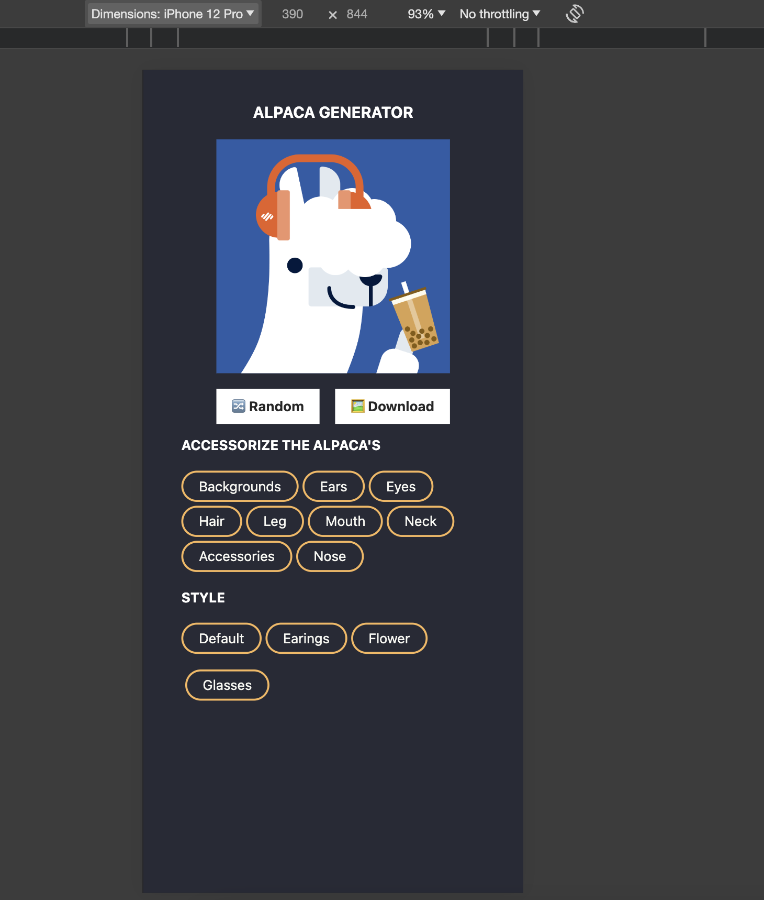
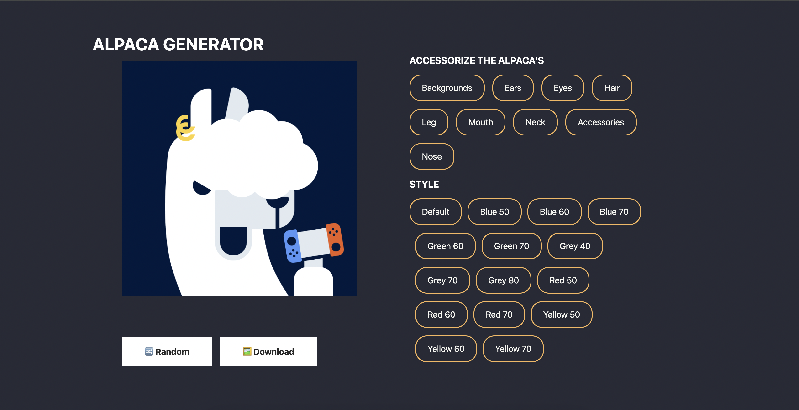
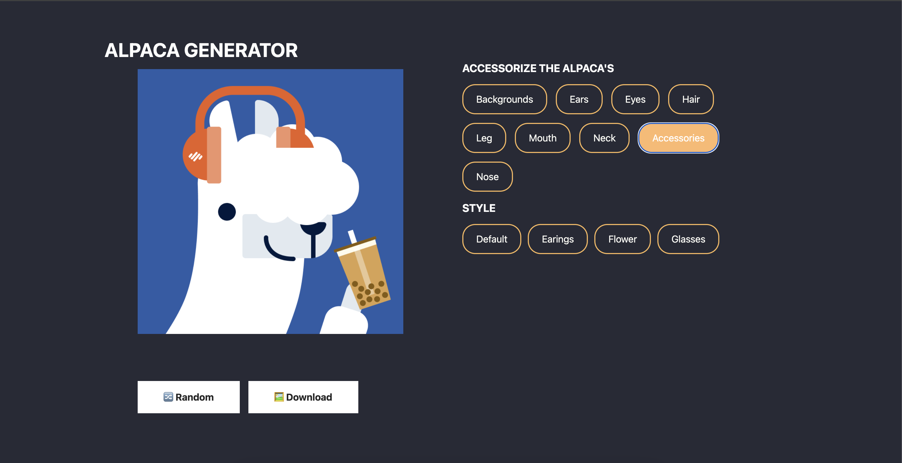

# Alpaca Image Generator

This project is a web application that allows users to generate custom alpaca images. It is built using SolidJS, TypeScript, and Vite.

## Features

- Customizable alpaca images
- Global state management with Zustand
- Image downloading using html2canvas

## Installation

1. Clone the repository: `git clone https://github.com/your-username/alpaca-image-generator.git`
2. Install dependencies: `npm install`

## Usage

1. Start the development server: `npm run dev`
2. Open your browser and navigate to `http://localhost:5173`

## Screenshots

